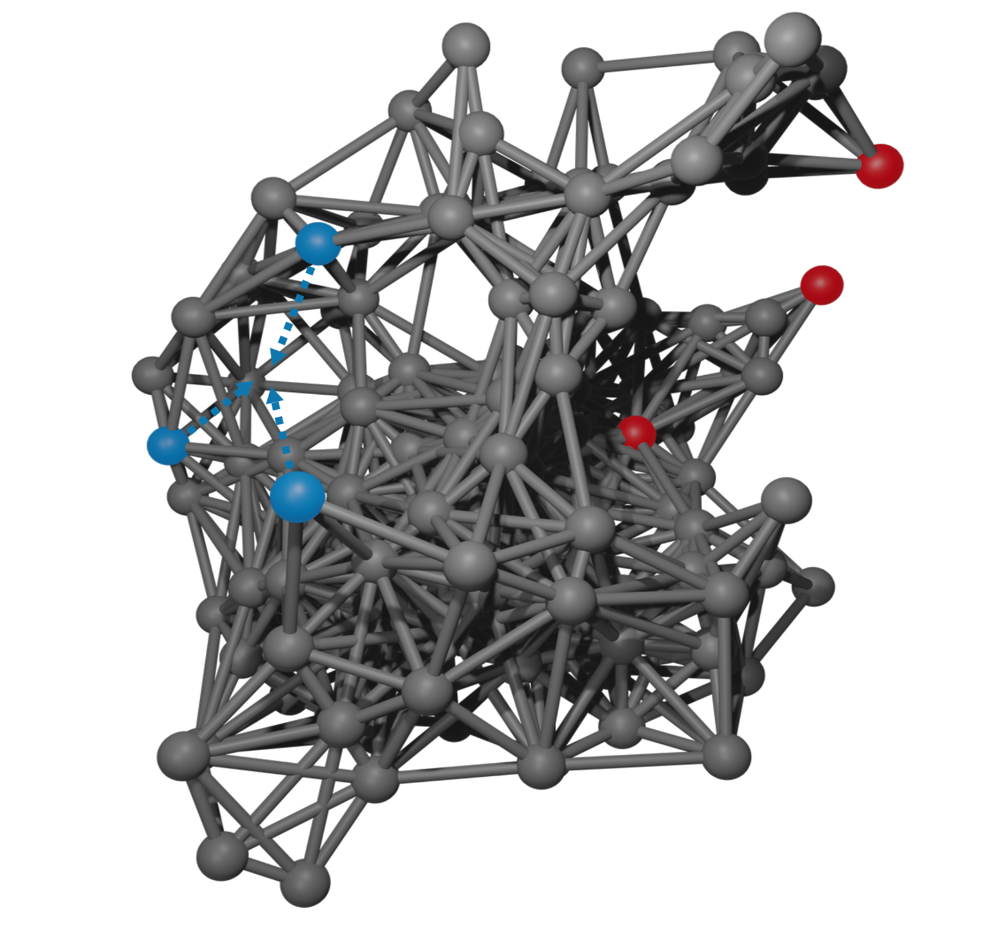

<p align="center">
  <a href="https://arxiv.org/pdf/2311.12025">
    
  </a>
</p>

<h1 align="center">elastory</h1>

<p align="center">
  tools for studying long ranged <i><b>— allosteric — </b></i> effects in elastic materials or proteins on a mechanical basis
  <br>
  <a href="https://arxiv.org/pdf/2311.12025"><strong>Read our paper »</strong></a>
  <br>
  <br>
  <a href="./notebooks/examples">Look at our Examples</a>
  ·
  <a href="./notebooks/results">Reproduce our results</a>

</p>

## Installation

Will be available as package on PyPI soon.

```bash
pip install elastory
```

## Usage

You might wan't to have a look at the [examples](./notebooks/examples).

## Publication

Please have a look at our [paper](https://arxiv.org/pdf/2311.12025) and cite us when using my code.

```bibtex
@misc{vossel2023allosteric,
    title={The allosteric lever: towards a principle of specific allosteric response},
    author={Maximilian Vossel and Bert L. de Groot and Aljaž Godec},
    year={2023},
    eprint={2311.12025},
    archivePrefix={arXiv},
    primaryClass={physics.bio-ph}
}
```

## Contributing

Pull requests are more than welcome. For major changes, please open an [issue](https://github.com/maxvossel/elastory/issues) first to discuss what you would like to change or add.

## Project status

Work on this project has slowed down since I left academia for an [AI startup](https://lector.ai). I still like this project however and would be happy to help anyone using it. I can not promise anything but will do my best to provide support. :)
